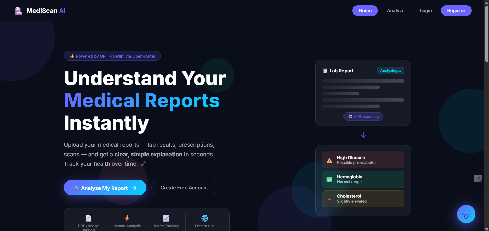
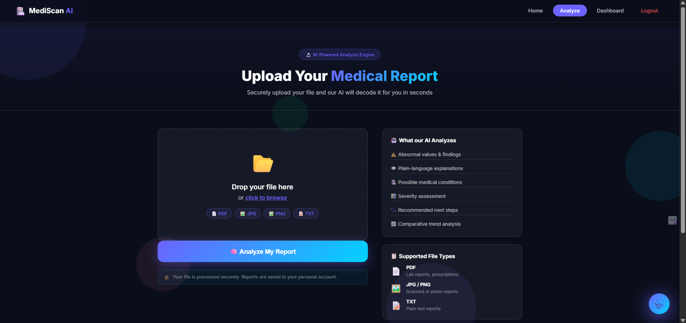
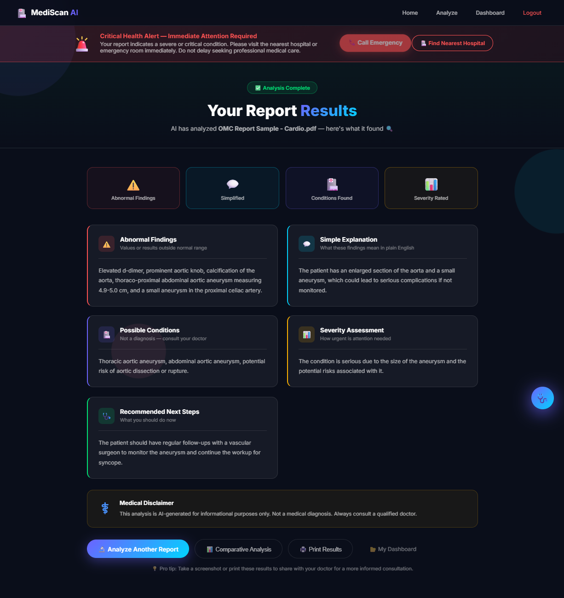
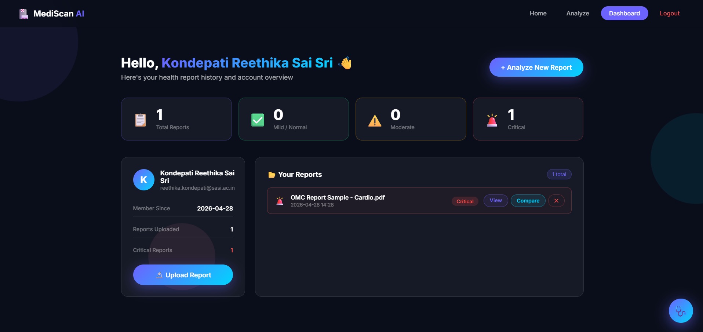

# 🏥 MediScan AI  
### 🚀 AI-Powered Medical Report Simplifier  


---

## ✨ Overview

**MediScan AI** is an intelligent web-based healthcare application designed to simplify complex medical reports using **Artificial Intelligence (AI)** and **Optical Character Recognition (OCR)** technologies.

Medical reports often contain complicated terminology that is difficult for non-medical users to understand. This project bridges that gap by transforming raw medical data into **clear, meaningful, and actionable insights**.

🔍 With just a few clicks, users can:
- Upload medical reports  
- Extract and process medical data  
- Understand health conditions in simple language  
- Track their health over time  

---

## 🎯 Problem Statement

Understanding medical reports is a major challenge for patients due to:
- Complex medical terminology  
- Lack of accessible explanations  
- No easy way to track health trends  

👉 **Solution:**  
MediScan AI simplifies reports and provides AI-generated insights in an easy-to-understand format.

---

## 🚀 Key Features

### 📤 Smart File Upload
- Supports multiple formats: **PDF, JPG, PNG, TXT**
- Drag-and-drop upload interface
- Secure file handling system  

### 🔍 Intelligent Text Extraction
- Uses **OCR (Tesseract)** for images and scanned documents  
- Uses **pdfplumber** for digital PDFs  
- Converts unstructured data into readable text  

### 🤖 AI-Powered Analysis
- Uses GPT-based AI model to:
  - Identify abnormal findings  
  - Explain medical terms in simple language  
  - Predict possible conditions  
  - Suggest next steps  

### 📊 Severity Detection System
- Automatically classifies reports into:
  - Mild  
  - Moderate  
  - Critical  
- Helps users understand urgency  

### 🚨 Smart Alerts
- Critical cases trigger **emergency warnings**
- Moderate cases suggest doctor consultation  

### 📈 Comparative Analysis
- Compares current reports with previous ones  
- Identifies:
  - Improvements  
  - Worsening conditions  
  - Overall health trends  

### 🔐 Authentication System
- Secure login & registration  
- Personalized report storage  

### 📂 Dashboard
- Displays all uploaded reports  
- Shows severity statistics  
- Tracks health history over time  

---

## 🧠 Tech Stack

| Layer           | Technology Used |
|----------------|---------------|
| Backend        | Python, Flask |
| Frontend       | HTML, CSS, JavaScript |
| AI Model       | GPT-4o Mini |
| OCR Engine     | Tesseract |
| PDF Processing | pdfplumber |
| Image Handling | Pillow |
| Database       | SQLite |

---

## 🏗️ System Architecture

```
User
  ↓
Frontend Interface (HTML, CSS, JS)
  ↓
Flask Backend Server
  ↓
File Upload Handling
  ↓
Text Extraction (OCR / PDF)
  ↓
AI Analysis Engine (GPT Model)
  ↓
Processed Results
  ↓
Database Storage (SQLite)
  ↓
Dashboard & Visualization
```

---

## ⚙️ Installation & Setup

### 1️⃣ Clone Repository
```bash
git clone https://github.com/your-username/mediscan-ai.git
cd mediscan-ai
```

### 2️⃣ Install Dependencies
```bash
pip install -r requirements.txt
```

### 3️⃣ Configure API Key
Update your API key inside `app.py`:

```python
client = OpenAI(
    api_key="YOUR_API_KEY",
    base_url="https://openrouter.ai/api/v1"
)
```

### 4️⃣ Run Application
```bash
python app.py
```

### 5️⃣ Open in Browser
```
http://127.0.0.1:5000/
```

---

## 📊 How the System Works

1. User logs into the system  
2. Uploads a medical report  
3. System extracts text using OCR or PDF tools  
4. AI analyzes the extracted content  
5. Generates structured output:
   - Abnormal findings  
   - Simplified explanation  
   - Possible conditions  
   - Severity level  
   - Recommended actions  
6. Results are displayed on the UI  
7. Data is stored for future comparison  

---

## 📸 Screenshots

> Add project screenshots here for better visualization

<p align="center">
  <b>Home Page</b><br>
  
</p>

<p align="center">
  <b>Upload Page</b><br>
  
</p>

<p align="center">
  <b>Result Page</b><br>
  
</p>

<p align="center">
  <b>Dashboard</b><br>
  
</p>

---

## 🔒 Security & Privacy

- User data is stored securely  
- Authentication system ensures privacy  
- Reports are linked to individual accounts  
- No unauthorized access to data  

---

## 🎯 Future Enhancements

- 💬 AI Chatbot for health queries  
- 🌐 Multi-language support  
- 🏥 Doctor consultation integration  
- 📱 Mobile application version  
- 📊 Advanced analytics dashboard  

---

## 👩‍💻 Author

**Reethika Kondepati**  
**Mail:** reethikakondepati9@gmail.com
🎓 **B.Tech** in Information Technology  

---

## 🌟 Support & Feedback

If you find this project useful:

⭐ Star the repository  
📢 Share with others  
💡 Suggest improvements  

---

## ⚠️ Disclaimer

This application provides AI-generated insights for informational purposes only.  
It is **not a substitute for professional medical advice**. Always consult a qualified doctor.

---

## 🚀 Final Note

**MediScan AI aims to make healthcare more accessible by transforming complex medical data into simple, understandable insights using modern AI technologies.**
